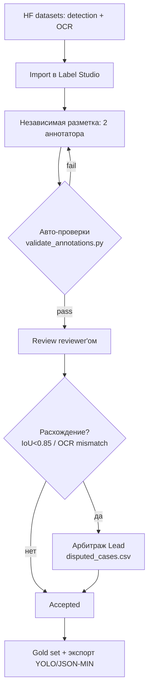

# Data Specification

## 1. Источники данных (Data Sources)

### 1.1 Датасет детекции номерных знаков
* **Датасет:** Russian Car Plate Detecting Dataset.
* **Источник:** Hugging Face.
* **Ссылка:** [Car_plate_detecting_dataset](https://huggingface.co/datasets/AY000554/Car_plate_detecting_dataset)
* **Формат:** PNG изображения.
* **Объём:** ~25 632 изображений российских автомобилей с номерами одного типа.

### 1.2 Датасет распознавания номерных знаков (OCR)
* **Датасет:** Russian Car Plate OCR Dataset.
* **Источник:** Hugging Face.
* **Ссылка:** [Car_plate_OCR_dataset](https://huggingface.co/datasets/AY000554/Car_plate_OCR_dataset)
* **Формат:** PNG изображения (вырезанные номерные знаки).
* **Объём:** ~45 514 изображений номеров.

## 2. Разбиение на выборки (Splits)

### 2.1 Car_plate_detecting_dataset

| Выборка | Количество изображений | Доля   |
|---------|------------------------|--------|
| train   | 20 505                 | 80%    |
| val     | 2 563                  | 10%    |
| test    | 2 564                  | 10%    |
| **Итого** | **25 632**           | **100%** |

### 2.2 Car_plate_OCR_dataset

| Выборка | Количество изображений | Доля   |
|---------|------------------------|--------|
| train   | 37 775                 | 83%    |
| val     | 4 891                  | 10,7%  |
| test    | 2 845                  | 6,3%   |
| **Итого** | **45 514**           | **100%** |

## 3. Схема и разметка (Annotation)

### 3.1 Детекция (Car_plate_detecting_dataset)
* **Задача:** Обнаружение (локализация) номерного знака на изображении автомобиля.
* **Формат разметки:** YOLO — текстовый файл `.txt` с именем, совпадающим с именем изображения.
* **Структура:** `class x_center y_center width height` (нормализованные координаты).
* **Количество классов:** 1 (номерной знак).

### 3.2 Распознавание / OCR (Car_plate_OCR_dataset)
* **Задача:** Распознавание текста номерного знака по его изображению.
* **Формат разметки:** Имя файла изображения содержит текст номера (латинские заглавные буквы и цифры), например `A129XY196.png`.
* **Алфавит символов:** `1234567890ABEKMHOPCTYX`

## 4. Проверки и контракты (Data Checks / Validation)

### 4.1 Общие проверки (обе задачи)
* **Формат файлов:** Система принимает только `image/jpeg` и `image/png`. Иные форматы отклоняются с ошибкой до начала инференса.
* **Разрешение:** Минимально допустимое разрешение снимка: `256×256` пикселей. Если меньше — выдаётся ошибка.
* **Целостность изображения:** Проверяется, что файл не повреждён (корректный заголовок PNG/JPEG, файл читается без ошибок). Повреждённые файлы отклоняются.
* **Fail-Fast (Out-of-Domain):** Если на вход подаётся изображение, не относящееся к предметной области (шум, случайное фото, не автомобиль/не номерной знак), система отбраковывает его (Data Contract Violation) до запуска тяжёлых моделей.

## 5. Ручная разметка и контроль качества (Manual Annotation & QC)

Исходные датасеты с Hugging Face поставляются уже размеченными, поэтому команда
не выполняет разметку «с нуля», а проводит **повторную ручную верификацию
(re-annotation review)** репрезентативного подмножества в **Label Studio**.
Цель — проверить качество исходных меток, измерить согласованность аннотаторов
и сформировать эталонный (gold) набор для оценки моделей.

### 5.1 Процесс

### 5.2 Артефакты

| Артефакт | Расположение |
| :--- | :--- |
| Гайдлайн по разметке | [`Annotation_Guidelines.md`](./Annotation_Guidelines.md) |
| Отчёт по ручной разметке и QC | [`Manual_Labeling_Report.md`](./Manual_Labeling_Report.md) |
| Конфиги Label Studio | `annotation/label_studio/*.xml` |
| Пример экспорта (JSON-MIN) | `annotation/label_studio/export_*.json` |
| Скрипты (валидация, конвертация, IAA) | `annotation/scripts/` |
| Метрики согласованности | `annotation/reports/agreement_summary.json` |
| Спорные кейсы с решениями | `annotation/reports/disputed_cases.csv` |

### 5.3 Сводные метрики качества разметки

| Задача | Метрика согласия | Значение | Порог |
| :--- | :--- | :--- | :--- |
| Детекция | Средний IoU между аннотаторами | 0.881 | ≥ 0.85 |
| Детекция | Доля пар с IoU ≥ 0.85 | 79.7% | — |
| OCR | Exact Match Agreement | 97.6% | ≥ 95% |
| OCR | Cohen's κ (по символам) | 0.997 | ≥ 0.80 |

Спорные кейсы (52 детекция + 11 OCR) разрешены арбитром; решения зафиксированы
в `disputed_cases.csv`. Подробности — в `Manual_Labeling_Report.md`.
