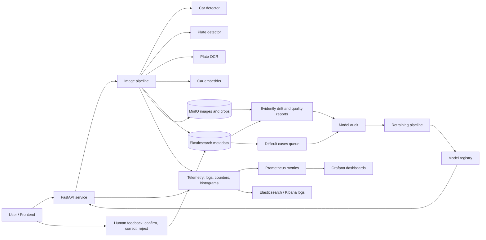

# Monitoring, Drift, and Retraining Plan

This document describes how AutobahnCV observes the service and each ML model,
how drift is detected, how human feedback is stored, and when retraining starts.

## 1. Model Scope

| Model          | App role                                            | Current production artifact                                                                   | Candidate artifact                             | Main quality metric                                |
|----------------|-----------------------------------------------------|-----------------------------------------------------------------------------------------------|------------------------------------------------|----------------------------------------------------|
| Car detector   | Detect and crop vehicle before all downstream steps | `src/models/car_detector.pt` or default YOLO vehicle model from `NEURON1_CAR_DETECTION_MODEL` | Best checkpoint from `ml/car_detector/runs/`   | mAP50, missed-car rate                             |
| Plate detector | Detect and crop license plate inside car crop       | `src/models/license_plate_detector.pt` from `NEURON2_PLATE_DETECTION_MODEL`                   | Best checkpoint from `ml/plate_detector/runs/` | mAP50, no-plate rate, crop quality                 |
| Plate OCR      | Read text from cropped plate                        | EasyOCR languages from `NEURON3_OCR_MODEL`, candidate `src/models/plate_ocr.pt`               | Best checkpoint from `ml/plate_ocr/runs/`      | exact plate accuracy, valid-format rate            |
| Car embedder   | Produce vector for similar-car search               | TorchVision ResNet from `NEURON4_RESNET_MODEL`, candidate `src/models/car_embedder.pt`        | Best checkpoint from `ml/car_embedder/runs/`   | top-k retrieval accuracy, cosine similarity margin |

For every training run, the training dataset version, git commit, model
parameters, validation metrics, and published artifact path must be recorded in
the model registry table below.

## 2. Metrics Table

### Service Metrics

| Metric                | Type       | Source                                 | Dashboard       | Target or threshold                 |
|-----------------------|------------|----------------------------------------|-----------------|-------------------------------------|
| Availability          | SLI        | FastAPI `/health`, Docker healthchecks | Service health  | >= 99% during demo/test window      |
| Request p95 latency   | SLI        | API middleware or Prometheus histogram | Service latency | p95 < 2 s for search/index requests |
| Error rate            | SLI        | HTTP status codes and exception logs   | Service errors  | 5xx < 2%, 4xx reviewed separately   |
| Throughput            | Load       | request counter by endpoint            | Service traffic | Track requests/min by endpoint      |
| Pipeline step latency | Diagnostic | pipeline timers per neuron             | Model pipeline  | Detect slow model or storage step   |

### Input Data Monitoring

| Signal                   | What is tracked                                                   | Applies to             | Drift rule                      |
|--------------------------|-------------------------------------------------------------------|------------------------|---------------------------------|
| Empty input              | zero-byte file, missing body, unsupported extension               | all requests           | alert if > 1% per hour          |
| Corrupted image          | PIL decode error, invalid dimensions                              | all requests           | alert if > 1% per hour          |
| Image structure          | width, height, aspect ratio, color mode, file size                | all models             | PSI > 0.2 against baseline      |
| Car crop structure       | crop width/height, bbox area ratio, bbox position                 | car detector, embedder | PSI > 0.2 or many tiny crops    |
| Plate crop structure     | crop width/height, blur score, bbox area ratio                    | plate detector, OCR    | PSI > 0.2 or crop too small     |
| Search request structure | provided plate length, normalized plate format, empty plate share | OCR, search            | invalid format rate grows by 2x |

### Model Prediction Monitoring

| Model          | Prediction signals                                                                      | Low-confidence definition                                           | Abnormal behavior                                                         |
|----------------|-----------------------------------------------------------------------------------------|---------------------------------------------------------------------|---------------------------------------------------------------------------|
| Car detector   | detection confidence, bbox area ratio, selected class, no-detection rate                | confidence < `NEURON1_CONFIDENCE_THRESHOLD`                         | no car in many valid images, bbox always covers whole image               |
| Plate detector | plate confidence, bbox area ratio, no-plate rate, fallback use                          | confidence < `NEURON2_CONFIDENCE_THRESHOLD` or heuristic fallback   | fallback growth, many empty/tiny plate crops                              |
| Plate OCR      | OCR confidence, valid Russian plate regex rate, string length, region code distribution | confidence < `NEURON3_CONFIDENCE_THRESHOLD` or invalid plate format | too many invalid plates, one region/class dominates suddenly              |
| Car embedder   | embedding norm, nearest-neighbor cosine score, top-k score gap, empty result share      | top-1 similarity below search threshold                             | embedding norm collapse, many near-identical vectors, empty search growth |

### Business and Feedback Metrics

| Metric                       | Meaning                                                               | Storage                                     | Used for                             |
|------------------------------|-----------------------------------------------------------------------|---------------------------------------------|--------------------------------------|
| Manual correction rate       | user changes predicted plate text                                     | Elasticsearch audit index or feedback table | OCR retraining and quality dashboard |
| Rejection rate               | user marks result as wrong                                            | feedback event                              | detector, OCR, embedder audit        |
| Controversial cases          | low confidence, invalid format, no results, conflicting OCR fragments | `difficult_cases` queue                     | manual review                        |
| Successful search rate       | request returns useful top-k candidates                               | API response logs and feedback              | business process metric              |
| Mean rank of accepted result | accepted result position in top-k                                     | feedback event                              | embedder/search quality              |

## 3. Observability Tools

| Responsibility           | Tool                                                         | Project usage                                                         |
|--------------------------|--------------------------------------------------------------|-----------------------------------------------------------------------|
| Metrics collection       | Prometheus                                                   | scrape FastAPI `/metrics` and service health metrics                  |
| Dashboards               | Grafana                                                      | service, data, prediction, drift, and quality dashboards              |
| Logs and metadata search | Elasticsearch + Kibana                                       | inspect request logs, audit events, difficult cases                   |
| Object storage           | MinIO                                                        | store uploaded images, debug crops, and reviewed samples              |
| Drift and profiling      | Evidently reports scheduled from recent ES/MinIO samples     | compare current inputs/predictions to training baseline               |
| Model versioning         | MLflow Model Registry or `reports/models/model_registry.csv` | record current, candidate, metrics, data version, commit              |
| Training data versioning | DVC or immutable MinIO dataset prefixes                      | bind each model version to exact data snapshot                        |
| Retraining orchestration | GitHub Actions, cron, or Airflow                             | run audit, training scripts in `ml/*`, evaluation, and promotion gate |

The local Docker stack already includes FastAPI, Elasticsearch, MinIO, and
optional Kibana. Prometheus, Grafana, MLflow, and Evidently are the selected
production monitoring extensions.

## 4. Dashboard Plan

| Dashboard            | Panels                                                                                                     |
|----------------------|------------------------------------------------------------------------------------------------------------|
| Service metrics      | availability, p95 latency, error rate, throughput, endpoint split                                          |
| Data monitoring      | image size distribution, decode failures, crop size distributions, invalid request share                   |
| Model predictions    | confidence histograms per model, low-confidence share, fallback share, predicted plate format distribution |
| Quality and drift    | PSI/KL drift signals, valid plate rate, manual correction rate, rejected result rate, top-k acceptance     |
| Registry and rollout | current model versions, candidate versions, validation metrics, production shadow metrics                  |

## 5. Alert Table

| Alert                          | Condition                                               | Owner action                                |
|--------------------------------|---------------------------------------------------------|---------------------------------------------|
| High p95 latency               | p95 search latency > 2 s for 10 minutes                 | inspect endpoint and per-neuron latency     |
| Error rate growth              | 5xx error rate > 2% for 10 minutes                      | inspect logs and failed dependency health   |
| Input corruption growth        | corrupted or unsupported inputs > 1% per hour           | check frontend upload flow and data source  |
| Data drift                     | any monitored input PSI > 0.2 for a daily window        | run audit report and sample manual review   |
| Plate detector fallback growth | heuristic fallback or no-plate rate > 10% daily         | review crops and detector validation set    |
| Low-confidence growth          | any model low-confidence share grows by 50% vs baseline | inspect difficult cases and run model audit |
| OCR invalid format growth      | invalid normalized plate rate > 15% daily               | inspect OCR crops and correction examples   |
| Search quality drop            | rejected result rate > 20% or accepted rank worsens     | audit embedder and ES retrieval             |
| Retraining pipeline failure    | training, evaluation, or publish job fails              | block promotion and inspect CI/Airflow logs |

## 6. Drift Signals

Drift is checked against a fixed baseline built from the training and validation
data of the current production model.

| Area             | Baseline                              | Current window                         | Drift signal                                                                |
|------------------|---------------------------------------|----------------------------------------|-----------------------------------------------------------------------------|
| Raw image data   | training images per model             | last 1 day and last 7 days of requests | PSI on width, height, aspect ratio, file size, brightness                   |
| Car detector     | validation detections                 | recent car detections                  | confidence shift, bbox area shift, no-car growth                            |
| Plate detector   | validation plate boxes                | recent plate detections                | confidence shift, plate bbox area shift, no-plate growth                    |
| OCR              | validation crop predictions           | recent OCR predictions                 | confidence shift, invalid regex growth, character/region distribution shift |
| Embedder         | validation embedding vectors          | recent query/index vectors             | norm shift, nearest-neighbor score shift, low top-k separation              |
| Business quality | accepted validation or reviewed cases | user feedback events                   | correction and rejection growth                                             |

Retraining is not started from drift alone. Drift starts audit. Retraining starts
only if audit shows quality loss, enough labeled corrections exist, or a known
new data segment must be supported.

## 7. Human Feedback Loop

1. User uploads an image for indexing or search.
2. The pipeline stores predictions: car bbox, plate bbox, OCR text, OCR
   confidence, embedding metadata, model versions, and request id.
3. UI shows the predicted plate and search results.
4. User can confirm, correct the plate, reject the result, or mark a case as
   controversial.
5. Feedback is stored in an Elasticsearch audit index with links to MinIO image
   objects and debug crops.
6. Low-confidence, fallback, rejected, and corrected cases are added to the
   `difficult_cases` review queue.
7. Reviewed cases are exported as new labeled data for the model that failed:
   car detector, plate detector, OCR, or embedder.

Minimum feedback event schema:

```json
{
  "request_id": "uuid",
  "timestamp": "2026-05-12T00:00:00Z",
  "image_s3_key": "uploads/example.jpg",
  "model_versions": {
    "car_detector": "car_detector:current",
    "plate_detector": "license_plate_detector:current",
    "ocr": "easyocr:en-ru",
    "embedder": "resnet50:torchvision"
  },
  "prediction": {
    "plate_number": "E507MO136",
    "confidence": 0.73
  },
  "user_feedback": {
    "status": "corrected",
    "correct_plate_number": "E507MO138",
    "accepted_result_rank": 2
  }
}
```

## 8. Model Registry

The project keeps a registry row for every published and candidate model.

| Field                 | Meaning                                                       |
|-----------------------|---------------------------------------------------------------|
| model_name            | `car_detector`, `plate_detector`, `plate_ocr`, `car_embedder` |
| stage                 | `production`, `candidate`, `archived`                         |
| artifact_path         | path in `src/models` or registry URI                          |
| training_data_version | Hugging Face repo revision, DVC hash, or MinIO prefix         |
| code_version          | git commit used for training                                  |
| validation_metrics    | model-specific metrics from `evaluate_*` script               |
| monitoring_baseline   | path to baseline profile used for drift checks                |
| promotion_notes       | what changed compared with current production                 |

Example:

| model_name     | stage      | artifact_path                                               | training_data_version                             | validation_metrics                                 |
|----------------|------------|-------------------------------------------------------------|---------------------------------------------------|----------------------------------------------------|
| plate_detector | production | `src/models/license_plate_detector.pt`                      | `AY000554/Car_plate_detecting_dataset@<revision>` | `mAP50`, `mAP50-95`, no-plate rate                 |
| plate_detector | candidate  | `ml/plate_detector/runs/russian_plate_yolo/weights/best.pt` | same plus reviewed difficult cases                | compare against production on fixed validation set |

## 9. Retraining Rules

### When to Run Audit

Run an audit when any of these happens:

| Trigger                      | Audit action                                     |
|------------------------------|--------------------------------------------------|
| data drift alert fires       | generate Evidently profile and inspect samples   |
| low-confidence share grows   | review per-model confidence and crop examples    |
| fallback share grows         | inspect plate detector and OCR failures          |
| manual corrections grow      | label corrected samples and assign failure owner |
| new camera/source appears    | build source-specific validation slice           |
| before planned model release | compare current vs candidate on fixed test set   |

### When to Retrain

Retrain a model only when the audit identifies enough useful data and a clear
failure mode.

| Model          | Retrain when                                                            | Do not retrain when                                           |
|----------------|-------------------------------------------------------------------------|---------------------------------------------------------------|
| Car detector   | many valid images have missed/wrong car crops, new camera angle appears | errors are caused by corrupted uploads or bad frontend resize |
| Plate detector | plate crop misses, wrong boxes, fallback/no-plate growth                | OCR fails on good plate crops                                 |
| Plate OCR      | corrected plate text accumulates, invalid format grows on good crops    | detector crop is blurred, cut, or does not contain plate      |
| Car embedder   | accepted results drop, top-k similarity no longer separates same car    | ES index is stale or plate filter is wrong                    |

### Promotion Policy

1. ML owner trains candidate in the matching `ml/<model>` workspace.
2. Candidate is evaluated on fixed validation set and recent difficult cases.
3. Candidate must improve the main metric and must not regress latency or
   critical slices.
4. Team lead or ML owner approves promotion.
5. Artifact is copied to `src/models` or promoted in MLflow.
6. Rollout starts as shadow or limited traffic if possible.
7. Monitoring compares current and candidate metrics for at least one day before
   full replacement.

## 10. Monitoring Contour Diagram



## 11. Self-Check Answers

| Question                    | Project answer                                                                                                                                                |
|-----------------------------|---------------------------------------------------------------------------------------------------------------------------------------------------------------|
| Service vs model monitoring | Service monitoring checks API health, latency, errors, and throughput. Model monitoring checks inputs, confidence, predictions, drift, feedback, and quality. |
| Which tool is needed        | Prometheus/Grafana for metrics, Elasticsearch/Kibana for logs and feedback, Evidently for drift, MLflow/DVC for model and data versions.                      |
| What signals indicate drift | PSI or distribution shift in image structure, crop structure, confidence, valid plate rate, embedding norms, similarity scores, and feedback rates.           |
| When retraining is needed   | After audit confirms quality loss or new labeled data covers a repeated failure mode.                                                                         |
| What is currently serving   | The service reads model paths from `src/app/core/config.py` and `.env`; production artifacts are mounted from `src/models` into `/app/models`.                |
